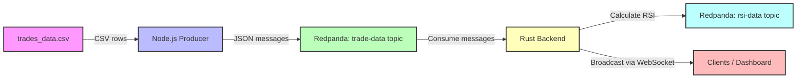

````markdown
# RSI Service with Rust, Redpanda & WebSocket

This project demonstrates a full pipeline for ingesting trade data, calculating RSI (Relative Strength Index) for tokens, and broadcasting results via WebSocket. It uses **Redpanda** (Kafka-compatible), **Rust**, and **Node.js** for CSV ingestion.

---

## Table of Contents

- [Overview](#overview)
- [Phase 1: Infrastructure Setup](#phase-1-infrastructure-setup-docker--redpanda)
- [Phase 2: Data Ingestion](#phase-2-data-ingestion-csv-to-redpanda)
- [Phase 3: Backend Processing with Rust](#phase-3-backend-processing-with-rust)
- [WebSocket Live Feed](#websocket-live-feed)
- [Project Structure](#project-structure)
- [Prerequisites](#prerequisites)
- [Running the Project](#running-the-project)
- [License](#license)

---

## Overview

This project implements a real-time RSI monitoring service for token trades:

1. **CSV Data Ingestion**: Node.js script reads `trades_data.csv` and publishes trades to Redpanda (`trade-data` topic).
2. **RSI Calculation**: Rust backend consumes trades, calculates RSI per token, and publishes results to `rsi-data`.
3. **WebSocket Feed**: Rust service also broadcasts live token RSI data to connected clients via WebSocket.

---

## Phase 1: Infrastructure Setup (Docker + Redpanda)

**Goal**: Create a containerized local environment for Redpanda with a management UI.

### Steps

1. Install **Docker** and **Docker Compose**.
2. Create `docker-compose.yml` with services:
   - **Redpanda Brokers** (`redpanda-0`, `redpanda-1`, `redpanda-2`)
   - **Redpanda Console** (`redpanda-console`) for UI.
3. Expose Redpanda Console at [http://localhost:8080](http://localhost:8080).
4. Use Console to create topics:
   - `trade-data`
   - `rsi-data`
5. Verify services using Docker CLI:

```bash
docker compose up -d
docker ps
````

📝 **Tip**: Use the console UI to check incoming messages in each topic.

---

## Phase 2: Data Ingestion (CSV → Redpanda)

**Goal**: Read a CSV file and publish rows as JSON messages to Redpanda.

### Steps

1. Inspect `trades_data.csv`. Example columns:

   * `token_address`
   * `price_in_sol`
   * `block_time`
2. Node.js script `ingest_trades.js` reads CSV and publishes messages:

```bash
node ingest_trades.js
```

3. The script:

   * Connects to Redpanda
   * Creates `trade-data` topic if missing
   * Streams JSON trades from CSV

4. Confirm trades in Redpanda Console.

---

## Phase 3: Backend Processing with Rust

**Goal**: Consume trade messages, calculate RSI, and send results.

### Steps

1. Set up Rust project:

```bash
cargo new rsi_service
cd rsi_service
```

2. Add dependencies in `Cargo.toml`:

```toml
tokio = { version = "1", features = ["full"] }
rdkafka = { version = "0.38.0", features = ["tokio"] }
serde = { version = "1", features = ["derive"] }
serde_json = "1.0"
futures-util = "0.3.31"
warp = "0.3"
```

3. Rust backend:

   * Connects to `trade-data`
   * Tracks `price_in_sol` history per token
   * Calculates 14-period RSI
   * Publishes results to `rsi-data` and broadcasts via WebSocket

4. RSI ranges:

| RSI Value | Meaning    |
| --------- | ---------- |
| > 70      | Overbought |
| < 30      | Oversold   |
| 30-70     | Neutral    |

5. Run the service:

```bash
cargo run
```

---

## WebSocket Live Feed

* Rust backend exposes WebSocket at `ws://localhost:4040/ws`.
* Clients receive real-time RSI updates in JSON format:

```json
{
  "token": "TOKEN_ADDRESS",
  "price": 10.5,
  "rsi": 72.3,
  "block_time": "2025-10-05T19:00:00Z"
}
```

* Useful for dashboards or trading bots.

---

## Project Structure

```
rsi_project/
├─ trades_data.csv         # Sample trade data
├─ ingest_trades.js        # Node.js CSV → Redpanda ingestion
├─ rsi_service/            # Rust backend
│  ├─ Cargo.toml
│  └─ src/
│     └─ main.rs           # RSI calculation & WebSocket server
├─ docker-compose.yml      # Redpanda + Console setup
└─ README.md
```

---

## Prerequisites

* Docker & Docker Compose
* Node.js (v18+)
* Rust + Cargo
* Optional: WebSocket client (browser, Postman, or custom UI)

---

## Running the Project

1. **Start Redpanda and Console**:

```bash
docker compose up -d
```

2. **Ingest CSV data**:

```bash
node ingest_trades.js
```

3. **Run Rust backend**:

```bash
cargo run
```

4. **Connect to WebSocket**:

```js
const ws = new WebSocket("ws://localhost:4040/ws");
ws.onmessage = (msg) => console.log("RSI update:", msg.data);
```

---

## License

MIT License © 2025

```

This README explains the full workflow: Docker setup, CSV ingestion, Rust backend, and live WebSocket broadcasting, making it ready for GitHub.  
Here’s a simple **workflow diagram** you can include in your README to visually represent the data flow of your project. I’ll provide it in **Markdown-friendly format** using Mermaid, which GitHub supports.

````markdown
## Workflow Diagram



### How it works:

1. **CSV file**: Your trade data source.
2. **Node.js Producer**: Reads CSV, converts to JSON, and sends to Redpanda (`trade-data` topic).
3. **Redpanda**: Kafka-compatible broker that stores trade messages.
4. **Rust Backend**: Consumes trades, maintains price history per token, calculates RSI, and publishes results.
5. **RSI Output**:
   - `rsi-data` topic in Redpanda
   - Live WebSocket feed to connected clients (dashboards, bots, etc.)
```
